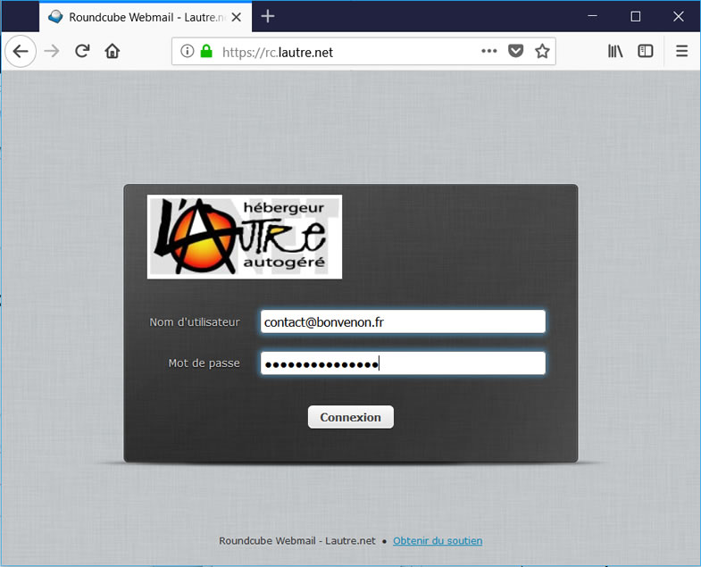
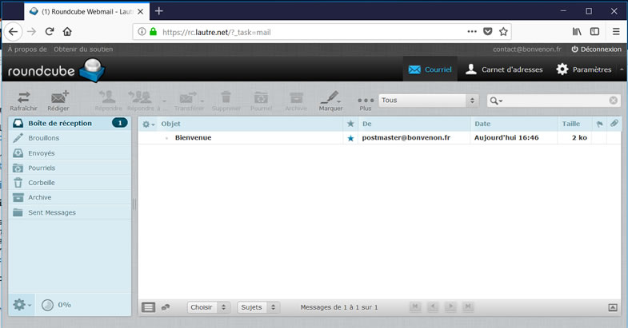
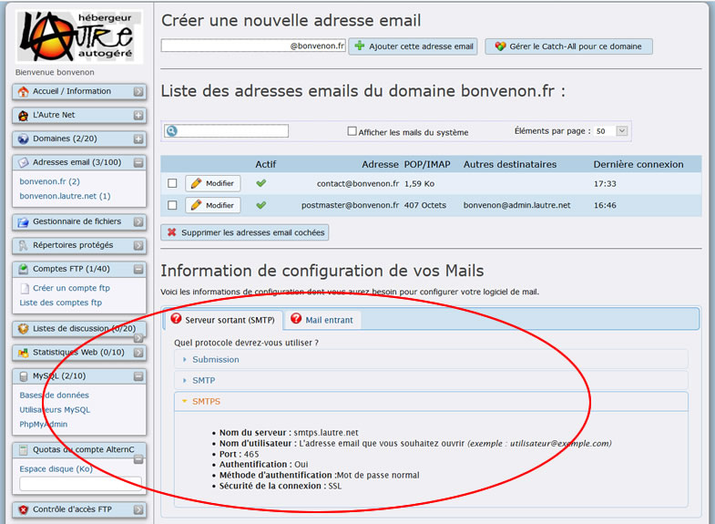
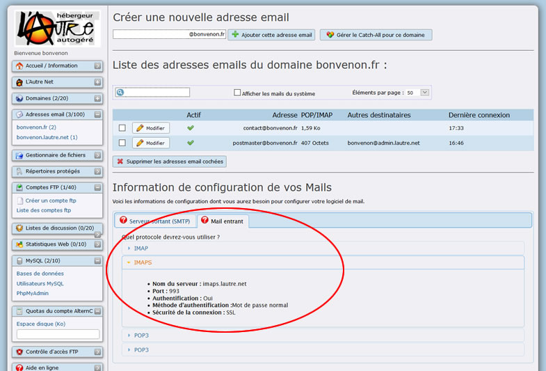
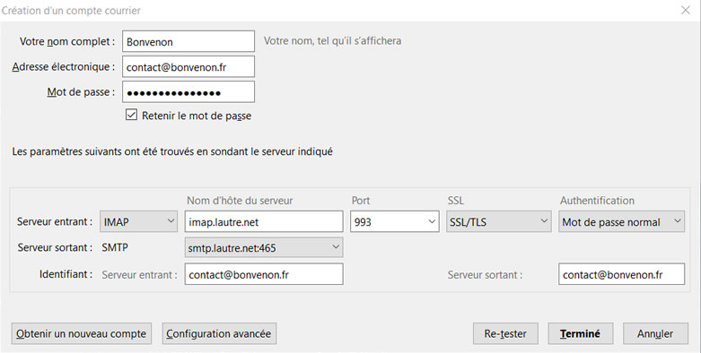

Title: 02. Webmail et outil de messagerie 
Date: 2018-10-01 19:35:56
Category: 06. Gestion messagerie
Tags: old
Summary: Accès aux mails

Comment accéder à votre messagerie, soit en ligne par webmail sécurisé, soit depuis votre logiciel de mail, sur votre ordinateur.  

## Connexion au webmail

Vous pouvez vous connecter à l'interface sécurisée du webmail :

- soit depuis la page d'accueil : [https://lautre.net](https://lautre.net) (en cliquant sur "Webmail" dans la ligne de menu du haut à droite)
- soit depuis le lien "Pour lire votre mail dans un navigateur, cliquez ici pour vous rendre sur le webmail de votre serveur." au bas de la [page de connexion à l'interface de gestion de votre compte](https://admin.lautre.net)
- soit directement sur l'interface Roundcube : [https://rc.lautre.net](https://rc.lautre.net)

**ATTENTION : L'identifiant est l'adresse mail complète**.

  - Le mot de passe est celui qui a été attribué au compte mail concerné, ici : "contact@*bonvenon*.fr".
  - **_Remplacez cette adresse mise pour l'exemple par l'adresse que vous avez créée depuis votre bureau virtuel_** (voir le chapitre précédent [Mails et alias](http://aide.lautre.net/01-mails-et-alias.html)).

Lors de la première connexion au webmail une fenêtre de paramétrage apparait vous invitant à saisir votre identité.

Cliquer directement sur le bouton "Enregistrer" (Rectangle Rouge)

L’interface apparaît.

Voici la fenêtre du webmail. Nous ne la décrirons pas plus avant, les liens étant suffisamment explicites.

Nous vous proposons maintenant de configurer l'adresse « contact@*bonvenon*.fr » dans un logiciel de messagerie.

Nous vous proposons d'utiliser Thunderbird : c'est un logiciel libre. Multi plate-forme, il fonctionne aussi bien sous Linux que sous Windows ou MacOS.

Les paramètres sont les mêmes pour d'autres logiciels de courrier.

## Configuration de l'adresse dans un logiciel de courrier

Voici les informations nécessaires pour configurer un compte, ici dans Thunderbird.
Vous pouvez choisir de configurer votre compte en « pop » ou « imap ».

POP et IMAP sont deux protocoles de réception de courrier. Le protocole POP charge les messages sur le disque dur de votre ordinateur et vide le serveur. La consultation de ces messages est donc limitée, elle ne peut se faire que depuis l'ordinateur qui les a stockés.

Le protocole IMAP effectue une synchronisation avec le serveur, affiche les messages dans Thunderbird et les laisse sur le serveur. Il est possible alors d'avoir accès à ces messages depuis n'importe quel ordinateur connecté à Internet. À ne pas choisir si vous avez un espace limité sur le serveur qui héberge vos mails.

Les paramètres de connexion sont indiqués dans la partie adresse email du bureau viruel.

 Les protocoles se terminant par un "S" correspondent aux protocoles sécurisés.
 
 Cliquer sur le lien correspondant au protocole que vous souhaitez utiliser.
 
 Cliquer sur l'onglet "Mail entrant" pour les protocoles de réception de mails"
 
 
 
Voici la configuration pour le service d'envoi de message (SMTP) et la réception (IMAP) sous Thunderbird :

 
 